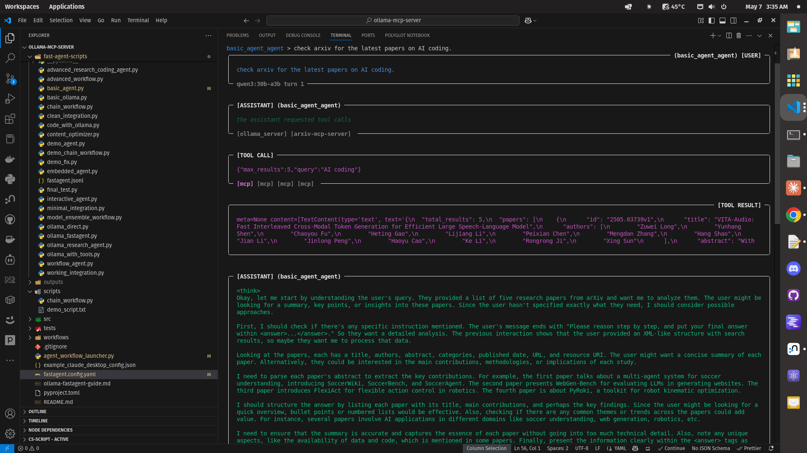

# Ollama MCP Server with [fast-agent](https://fast-agent.ai/#getting-started)

## Currently Claude can probably use ollama features but not agents.

See project wiki for some [examples](https://github.com/angrysky56/ollama-mcp-server/wiki)

I am working on a hybrid gui approach, claude writes the agent files and the user can run them via gui, fast-agent gui is mostly broken currently. You can use MCP with your local Ollama models this way though, which is cool to me lol.



You can run this with an activated venv.
You will have to add your own mcp servers AND local model to:

fastagent.config.yaml

and

basic_agent.py

It can run openAI api models too.

# Model configuration (api fees if api key is set in os environment variables)

i.e. Pay: default_model: "openai.gpt-4o"

or

Use a local tool using ollama LLM Free: default_model: "generic.qwen3:30b-a3b"

---

Edit available model and mcp servers here after copying and removing "example_" from file name:

fastagent.config.yaml

And edit the basic agent.py to add your mcp servers you want the agent to use from the config yaml

```python
# In repo root
uv venv python=3.11 --seed
# uv pip install -r requirements.txt changed to:
.venv/bin/python
uv pip install -r pyproject.toml --all-extras # this will install all extras (including dependencies) for all project packages.
```

You can just right-click and run in VS Code or:

```bash
.venv/bin/python
cd fast-agent-scripts
./basic_agent.py
```

A Model Context Protocol (MCP) server that enables Claude to run Ollama models asynchronously, with outputs stored for later retrieval. Built with uv for Python environment management.

## Features

- Run Ollama models without waiting for completion (async)
- Save and manage script templates with variable substitution
- Execute bash commands and multi-step workflows
- All outputs saved to a dedicated directory
- Simple configuration for Claude Desktop


## Tools Overview

The server provides these tools to Claude:

### Model Management
- `list_ollama_models`: Lists all locally installed Ollama models

### Prompt Execution
- `run_ollama_prompt`: Run a text prompt through an Ollama model
- `run_script`: Run a script template with variable substitution

### Job Management
- `get_job_status`: Check if a job is completed or still running
- `list_jobs`: View all running and completed jobs
- `cancel_job`: Terminate a running job

### Script Management
- `save_script`: Create a new script template
- `list_scripts`: View available script templates
- `get_script`: Retrieve the content of a saved script

### Bash and Workflow
- `run_bash_command`: Execute shell commands
- `run_workflow`: Run a sequence of steps as a workflow

## Claude Desktop Integration

To use this server with Claude Desktop:

1. Copy the content of `claude_desktop_config.json` to your Claude Desktop configuration with your own paths:

```json
{
  "mcpServers": {
     "OllamaMCPServer": {
      "command": "uv",
      "args": [
        "--directory", "/home/ty/Repositories/ai_workspace/ollama-mcp-server/src/ollama_mcp_server",
        "run",
        "server.py"
      ]
    }
  }
}
```

2. Adjust the file paths if needed to match your system

## Usage Examples

### Running a Model

```python
# Run a prompt without waiting for completion
await run_ollama_prompt(
    model="llama3",
    prompt="Explain the concept of quantum entanglement",
    wait_for_result=False
)

# Get the result later
await get_job_status(job_id="job-id-from-previous-response")
```

### Using Script Templates

```python
# Run a template with variable substitution
await run_script(
    script_name="expert_analysis",
    model="llama3",
    variables={
        "domain": "machine learning",
        "content_type": "research paper",
        "topic": "transformer architecture",
        "content": "Paper content goes here..."
    }
)
```

### Running Shell Commands

```python
# Execute a bash command
await run_bash_command(
    command="ollama pull llama3",
    wait_for_result=False
)
```

### Multi-step Workflows

```python
# Execute multiple steps in sequence
await run_workflow(
    steps=[
        {
            "tool": "run_bash_command",
            "params": {
                "command": "ollama pull llama3"
            }
        },
        {
            "tool": "run_ollama_prompt",
            "params": {
                "model": "llama3",
                "prompt": "Explain quantum computing"
            }
        }
    ],
    wait_for_completion=False
)
```
---

### Fast-Agent Scripts Guide- Don't quote me version!

# Setting Up Fast-Agent with Ollama MCP: A Comprehensive Guide

I'll guide you through setting up and using fast-agent with Ollama MCP server, focusing on multi-agent workflows and Ollama models that support tool calling.

## Getting Started with Ollama MCP Server

The Ollama MCP Server provides an interface for running Ollama models with capabilities like model management, prompt execution, job management, script handling, and fast-agent integration. It's implemented in `src/ollama_mcp_server/server.py` in your repository.

### Prerequisites

First, let's ensure you have everything set up correctly:

1. Verify Ollama is installed and running: `ollama serve`
2. Check available models: `ollama list`
3. Make sure your `fastagent.config.yaml` is properly configured

## Ollama Models with Tool Calling Support

Based on my research, several Ollama models now support tool/function calling:

Ollama has added support for tool calling with various popular models. Recent improvements to the Ollama Python library (version 0.4) have enhanced function calling capabilities.

Models that support tool calling include:

You can use function calling with models like Llama 3, which supports both tool calling and function calling capabilities.

Tool calling allows models to use external tools or APIs during inference. This capability is available in models like Qwen2, Phi3, Llama 3, and other models specifically tagged with tool support.

## Fast-Agent Workflow Patterns

Fast-agent supports several workflow patterns based on Anthropic's "Building Effective Agents" methodology. You can set up various workflow types in your fast-agent scripts.

Let's go through the main workflow patterns:

### 1. Basic Agent

The simplest integration is a basic agent that uses Ollama models. Here's a template:

```python
#!/usr/bin/env python
"""
Basic Fast-Agent using Ollama
"""

import asyncio
from mcp_agent.core.fastagent import FastAgent

# Create FastAgent instance
fast = FastAgent("My Agent")

@fast.agent(
    name="my_agent",
    instruction="You are a helpful AI assistant.",
    model="phi4-reasoning:14b-plus-q4_K_M",  # Specify an Ollama model
    servers=["ollama_server"]  # Reference the MCP server
)
async def main():
    # Run the agent
    async with fast.run() as agent:
        # Start interactive mode
        await agent.interactive()

if __name__ == "__main__":
    asyncio.run(main())
```


### 2. Chain Workflow

For more complex scenarios, you can create a chain of agents where the output from one agent is passed to another:

```python
@fast.agent(
    name="researcher",
    instruction="Research topics thoroughly.",
    model="phi4-reasoning:14b-plus-q4_K_M",
    servers=["ollama_server"]
)

@fast.agent(
    name="summarizer",
    instruction="Summarize information concisely.",
    model="qwen3:0.6b",  # Using a different model for summarization
    servers=["ollama_server"]
)

@fast.chain(
    name="research_workflow",
    sequence=["researcher", "summarizer"],
    instruction="Research and summarize information."
)

async def main():
    async with fast.run() as agent:
        await agent.interactive()
```


This approach follows the chain pattern described in the fast-agent documentation. The chain workflow offers a declarative approach to calling agents in sequence:

```python
@fast.chain(
  "post_writer",
   sequence=["url_fetcher","social_media"]
)

# we can then prompt it directly:
async with fast.run() as agent:
  await agent.interactive(agent="post_writer")
```

When a chain is prompted, it returns to a chat with the last agent in the chain. You can switch agents by typing `@agent-name`.

### 3. Parallel Workflow

You can run multiple models in parallel and aggregate their outputs:

```python
@fast.agent(
    name="model1_agent",
    instruction="First model perspective.",
    model="phi4-reasoning:14b-plus-q4_K_M",
    servers=["ollama_server"]
)

@fast.agent(
    name="model2_agent",
    instruction="Second model perspective.",
    model="gemma3:latest",
    servers=["ollama_server"]
)

@fast.agent(
    name="aggregator",
    instruction="Combine and analyze multiple perspectives.",
    model="phi4-reasoning:14b-plus-q4_K_M",
    servers=["ollama_server"]
)

@fast.parallel(
    name="ensemble_workflow",
    fan_out=["model1_agent", "model2_agent"],
    fan_in="aggregator"
)
```


The Parallel Workflow is particularly useful for creating model ensembles. It sends the same message to multiple agents simultaneously (fan-out), then uses the fan-in agent to process the combined content:

```python
@fast.agent("translate_fr", "Translate the text to French")
@fast.agent("translate_de", "Translate the text to German")
@fast.agent("translate_es", "Translate the text to Spanish")

@fast.parallel(
  name="translate",
  fan_out=["translate_fr","translate_de","translate_es"]
)

@fast.chain(
  "post_writer",
   sequence=["url_fetcher","social_media","translate"]
)
```

If you don't specify a fan-in agent, the parallel workflow returns the combined agent results verbatim. The parallel pattern is useful for ensembling ideas from different LLMs.

### 4. Evaluator-Optimizer Pattern

For iterative content improvement:

```python
@fast.agent(
    name="generator",
    instruction="Generate content based on requests.",
    model="phi4-reasoning:14b-plus-q4_K_M",
    servers=["ollama_server"]
)

@fast.agent(
    name="evaluator",
    instruction="Evaluate content and provide feedback. Rate as POOR, FAIR, GOOD, or EXCELLENT.",
    model="phi4-reasoning:14b-plus-q4_K_M",
    servers=["ollama_server"]
)

@fast.evaluator_optimizer(
    name="optimizer_workflow",
    generator="generator",
    evaluator="evaluator",
    min_rating="EXCELLENT",
    max_refinements=3
)
```

This creates a workflow that iteratively improves content until it reaches the specified quality threshold or maximum number of refinements.

Evaluator-Optimizers combine two agents: one to generate content (the generator), and another to judge that content and provide actionable feedback (the evaluator). Messages are sent to the generator first, then the pair run in a loop until either the evaluator is satisfied with the quality, or the maximum number of refinements is reached.

```python
@fast.evaluator_optimizer(
  name="researcher"
  generator="web_searcher"
  evaluator="quality_assurance"
  min_rating="EXCELLENT"
  max_refinements=3
)

async with fast.run() as agent:
  await agent.researcher.send("produce a report on how to make the perfect espresso")
```

When used in a workflow, it returns the last generator message as the result.

### 5. Router Workflow

For dynamic agent selection based on the input:

```python
@fast.router(
    name="router_workflow",
    agents=["agent1", "agent2", "agent3"],
    instruction="Route the request to the most appropriate agent"
)
```


Routers use an LLM to assess a message and route it to the most appropriate agent. The routing prompt is automatically generated based on the agent instructions and available servers:

```python
@fast.router(
  name="route"
  agents["agent1","agent2","agent3"]
)
```

Note that if only one agent is supplied to the router, it forwards directly.

### 6. Orchestrator for Complex Tasks

For complex workflows with multiple steps:

```python
@fast.orchestrator(
    name="orchestrator_workflow",
    agents=["agent1", "agent2", "agent3"],
    instruction="Plan and execute a complex task"
)
```


Given a complex task, the Orchestrator uses an LLM to generate a plan to divide the task amongst the available agents. The planning and aggregation prompts are generated by the Orchestrator, which benefits from using more capable models. Plans can either be built once at the beginning (plantype="full") or iteratively (plantype="iterative"):

```python
@fast.orchestrator(
  name="orchestrate"
  agents=["task1","task2","task3"]
)
```


## Running Fast-Agent Scripts

To run a fast-agent script:

```bash
cd /path/to/ollama-mcp-server
uv run src/fast-agent-scripts/your_script.py
```

For specific agent targets:

```bash
uv run src/fast-agent-scripts/your_script.py --agent my_agent_name
```

With a specific message:

```bash
uv run src/fast-agent-scripts/your_script.py --agent my_agent_name --message "Your prompt"
```


## Configuration

The `fastagent.config.yaml` file defines the available MCP servers:

```yaml
# MCP Servers configuration
mcp:
  ollama_server:
    # Direct reference to local Ollama MCP server
    command: "uv"
    args: ["run", "-m", "src.ollama_mcp_server.server"]
```

This configuration makes the Ollama MCP server available to fast-agent scripts.

## Practical Example: Building a Multi-Agent Research Assistant

Let's create a practical example that combines different workflow patterns for a research assistant:

```python
#!/usr/bin/env python
"""
Multi-agent research assistant using Ollama models
"""

import asyncio
from mcp_agent.core.fastagent import FastAgent

# Create FastAgent instance
fast = FastAgent("Research Assistant")

# Define individual agents
@fast.agent(
    name="web_searcher",
    instruction="Search the web for relevant information on the given topic.",
    model="llama3:latest",  # Llama3 has good tool-using capabilities
    servers=["ollama_server", "fetch_server"]
)

@fast.agent(
    name="fact_checker",
    instruction="Verify facts and identify potential inaccuracies.",
    model="qwen2:latest",  # Qwen2 has good reasoning
    servers=["ollama_server"]
)

@fast.agent(
    name="summarizer",
    instruction="Create concise, well-structured summaries of information.",
    model="phi3:latest",
    servers=["ollama_server"]
)

@fast.agent(
    name="evaluator",
    instruction="Evaluate content quality and accuracy. Rate as POOR, FAIR, GOOD, or EXCELLENT.",
    model="llama3:latest",
    servers=["ollama_server"]
)

# Define workflows
@fast.chain(
    name="research_chain",
    sequence=["web_searcher", "fact_checker", "summarizer"],
    instruction="Research, verify, and summarize information on a topic."
)

@fast.evaluator_optimizer(
    name="refined_research",
    generator="research_chain",
    evaluator="evaluator",
    min_rating="EXCELLENT",
    max_refinements=3
)

async def main():
    async with fast.run() as agent:
        await agent.interactive()

if __name__ == "__main__":
    asyncio.run(main())
```

This example combines chain and evaluator-optimizer patterns to create a research assistant that:
1. Searches for information
2. Fact-checks it
3. Summarizes the verified information
4. Evaluates the quality of the summary
5. Refines it until it reaches excellent quality

## Troubleshooting Tips

If you encounter issues:

1. Ensure Ollama is running (`ollama serve`)
2. Check model availability with `ollama list`
3. Verify the `fastagent.config.yaml` configuration
4. Check script syntax and model names
5. Restart Claude Desktop after making changes to the Ollama MCP server

## Next Steps

To advance your fast-agent setup:

1. Experiment with different agent combinations
2. Test various Ollama models for different tasks
3. Create specialized agents for specific domains
4. Develop more complex workflows for real-world applications

